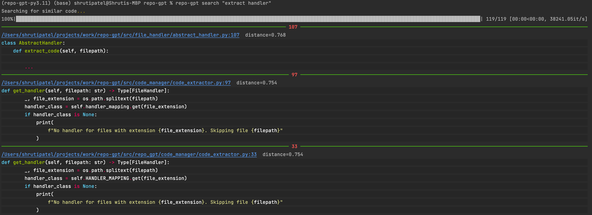

# Repo GPT
Search your code repository using GPT3.5.



## Contributing
### Setup
1. Install python `3.11` and latest version of [poetry](https://python-poetry.org/docs/#installing-with-pipx)
   1. `pyenv` is a good way to manage python versions if you need to have more than 1 on your computer
2. Add your openai key to your environment variables
```shell
export OPENAI_API_KEY=<insert your openai key>
```
4. Install dependencies: `poetry install --no-root`
5. Install pre-commit hooks: `poetry run pre-commit install`
6. Seed data: `poetry run python cli.py setup`
7. Query data: `poetry run python cli.py search <text/question>`

### Debugging
* View the output of the code_embeddings pkl: `pd.read_pickle('./.repo_gpt/code_embeddings.pkl', compression='infer')`
